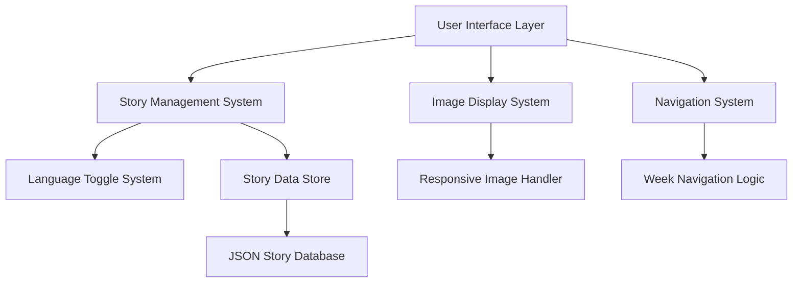

# Design Document

## Overview

The Weekly Art Showcase website will transform the existing static gallery into a dynamic, story-driven experience that presents artwork on a weekly rotation. Each piece will be accompanied by charming stories told from a 5-year-old boy's perspective in both English and Chinese, creating an engaging and educational experience for children and families.

The design leverages the existing 11 artwork pieces (3_pokemon.jpg, boats.jpg, boats2.jpg, fathers_day.jpg, golden_gate_bridge.jpg, goose.jpg, ice_cream_houses.jpg, lion.jpg, mona_lisa.jpg, panda.jpg, pikachu.jpg) to create an 11-week rotation cycle.

## Architecture

### High-Level Architecture



### Technology Stack

- **Frontend**: HTML5, CSS3, JavaScript (ES6+)
- **Responsive Framework**: CSS Grid and Flexbox
- **Data Storage**: JSON files for story content
- **Image Optimization**: CSS responsive images with srcset
- **Internationalization**: JavaScript-based language switching

## Components and Interfaces

### 1. Week Navigation Component

**Purpose**: Allows users to navigate between different weeks of artwork

**Interface**:
```javascript
class WeekNavigator {
  constructor(totalWeeks, currentWeek)
  nextWeek()
  previousWeek()
  goToWeek(weekNumber)
  getCurrentWeek()
}
```

**Features**:
- Previous/Next buttons
- Week indicator (e.g., "Week 3 of 11")
- Circular navigation (week 11 → week 1)
- Keyboard navigation support

### 2. Story Display Component

**Purpose**: Renders stories in both languages with kid-friendly formatting

**Interface**:
```javascript
class StoryDisplay {
  constructor(storyData, currentLanguage)
  renderStory(language)
  toggleLanguage()
  formatForChildren()
}
```

**Features**:
- Large, readable fonts
- Colorful text styling
- Language toggle button
- Smooth transitions between languages

### 3. Responsive Image Gallery

**Purpose**: Displays artwork optimized for all device sizes

**Interface**:
```javascript
class ResponsiveGallery {
  constructor(imageData)
  displayImage(imagePath, altText)
  optimizeForDevice()
  handleImageLoad()
}
```

**Features**:
- Responsive image sizing
- Lazy loading
- Touch-friendly interactions
- Lightbox functionality

### 4. Language Manager

**Purpose**: Handles bilingual content switching

**Interface**:
```javascript
class LanguageManager {
  constructor(defaultLanguage)
  setLanguage(language)
  getCurrentLanguage()
  getTranslation(key)
}
```

## Data Models

### Story Data Structure

```json
{
  "week": 1,
  "artwork": {
    "filename": "golden_gate_bridge.jpg",
    "title": {
      "en": "The Magic Red Bridge",
      "zh": "神奇的红桥"
    }
  },
  "story": {
    "en": {
      "title": "Tommy's Big Red Bridge Adventure",
      "content": "Once upon a time, Tommy saw the biggest, reddest bridge in the whole wide world! It looked like a giant's toy bridge that someone painted with the most beautiful red paint ever. Tommy imagined that friendly dragons lived under the bridge, and they helped all the cars drive safely across the water. The bridge was so tall that Tommy thought it could touch the clouds, and maybe the clouds would give it a high-five!"
    },
    "zh": {
      "title": "汤米的大红桥冒险",
      "content": "从前，汤米看到了全世界最大最红的桥！它看起来像巨人的玩具桥，有人用最美丽的红色油漆涂过。汤米想象着友善的龙住在桥下，它们帮助所有的汽车安全地穿过水面。这座桥太高了，汤米觉得它能碰到云朵，也许云朵会和它击掌呢！"
    }
  },
  "characters": {
    "en": ["friendly dragons", "giant", "Tommy"],
    "zh": ["友善的龙", "巨人", "汤米"]
  }
}
```

### Week Configuration

```json
{
  "totalWeeks": 11,
  "artworkRotation": [
    "golden_gate_bridge.jpg",
    "fathers_day.jpg",
    "lion.jpg",
    "boats.jpg",
    "boats2.jpg",
    "mona_lisa.jpg",
    "panda.jpg",
    "3_pokemon.jpg",
    "goose.jpg",
    "pikachu.jpg",
    "ice_cream_houses.jpg"
  ],
  "startDate": "2025-01-20"
}
```

## User Interface Design

### Layout Structure

```
┌─────────────────────────────────────┐
│           Header                    │
│     Weekly Art Showcase             │
├─────────────────────────────────────┤
│  [← Prev]  Week X of 11  [Next →]  │
├─────────────────────────────────────┤
│                                     │
│         Artwork Display             │
│        (Responsive Image)           │
│                                     │
├─────────────────────────────────────┤
│  [English] / [中文]                 │
├─────────────────────────────────────┤
│                                     │
│         Story Content               │
│     (Kid-friendly styling)          │
│                                     │
└─────────────────────────────────────┘
```

### Responsive Breakpoints

- **Mobile (320px - 768px)**: Single column, stacked layout
- **Tablet (769px - 1024px)**: Two-column layout with image and story side-by-side
- **Desktop (1025px+)**: Centered content with maximum width constraints

### Color Scheme

- **Primary**: Bright, cheerful colors (#FF6B6B, #4ECDC4, #45B7D1)
- **Background**: Soft pastels (#FFF9E6, #F0F8FF)
- **Text**: Dark gray for readability (#333333)
- **Accent**: Playful highlights (#FFD93D, #6BCF7F)

## Error Handling

### Image Loading Errors

- Display placeholder image with friendly message
- Retry mechanism for failed loads
- Graceful degradation for missing images

### Story Loading Errors

- Fallback to default story template
- Error logging for debugging
- User-friendly error messages

### Navigation Errors

- Boundary checking for week navigation
- Default to week 1 if invalid week requested
- Smooth error recovery

## Testing Strategy

### Unit Testing

- Story data parsing and validation
- Language switching functionality
- Week navigation logic
- Responsive image handling

### Integration Testing

- End-to-end user flows
- Cross-browser compatibility
- Device responsiveness testing
- Performance testing on mobile devices

### User Experience Testing

- Child-friendly interface validation
- Story readability assessment
- Navigation intuitiveness
- Language switching smoothness

### Accessibility Testing

- Screen reader compatibility
- Keyboard navigation
- Color contrast validation
- Font size accessibility

## Performance Considerations

### Image Optimization

- Responsive images with multiple sizes
- Lazy loading for better performance
- WebP format support with fallbacks
- Compression optimization

### Content Loading

- Progressive story loading
- Minimal JavaScript bundle size
- CSS optimization and minification
- Caching strategies for static content

### Mobile Performance

- Touch-optimized interactions
- Reduced animation complexity on mobile
- Efficient memory usage
- Fast initial page load